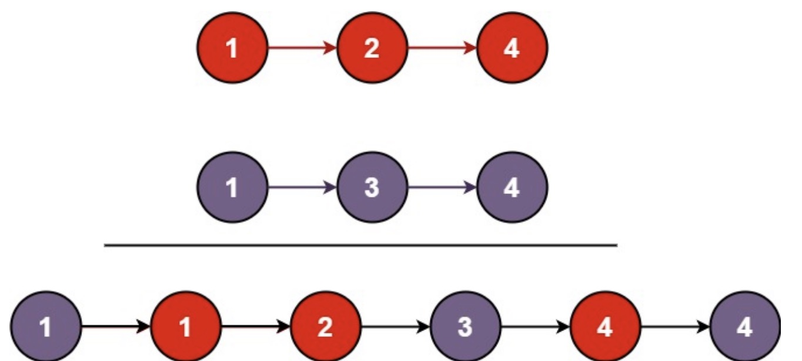

# 21.合并两个有序列表(简单)

题目描述：将两个升序链表合并为一个新的 升序 链表并返回。新链表是通过拼接给定的两个链表的所有节点组成的。 

实例1：

;

```js
输入：l1 = [1,2,4], l2 = [1,3,4]
输出：[1,1,2,3,4,4]
```

实例2：

```js
输入：l1 = [], l2 = []
输出：[]
```

实例3：

```js
输入：l1 = [], l2 = [0]
输出：[0]
```

```js
var mergeTwoLists = function(list1, list2) {  
    let dom=new ListNode(0);
    let cur=dom;
    //如果list1或者list2遍历完成
    while(list1 && list2){
        if(list1.val<=list2.val){ 
            cur.next=list1;
            list1=list1.next
        }else{
            cur.next=list2;
            list2=list2.next;
        }
        cur=cur.next
    }
    if(list1||list2){
        cur.next=list1 || list2;
    }
    return dom.next;
};
```