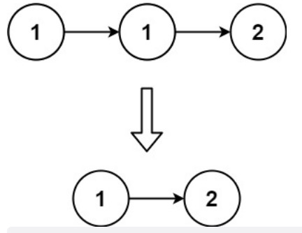
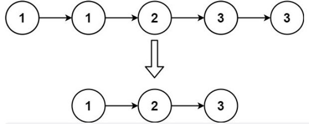

# 83.删除排序链表中的重复元素(简单)

题目描述：给定一个已排序的链表的头 head ， 删除所有重复的元素，使每个元素只出现一次 。返回 已排序的链表 。

实例1：



```js
输入：head = [1,1,2]
输出：[1,2]
```

实例2：



```js
输入：head = [1,1,2,3,3]
输出：[1,2,3]
```

```js
var deleteDuplicates = function(head) {
    let dom=new ListNode(0);
    let cur=dom;
    while(head){
        //当前下一个节点
        let temp=head.next; 

        //如果当前节点和下一节点相同 则cur.next指向下一节点temp head指针指向temp节点下一位
        if(temp && (head.val===temp.val)){
            cur.next=temp;
            head=temp.next;
        }else{ 
            cur.next=head;
            head=head.next;  
        }
        //当头节点和当当前节点的下一节点值不同时 移动当前节点 完成赋值操作
        if(head && (head.val!==cur.next.val)){
            cur=cur.next;
        }
    }
    return dom.next;
};
```