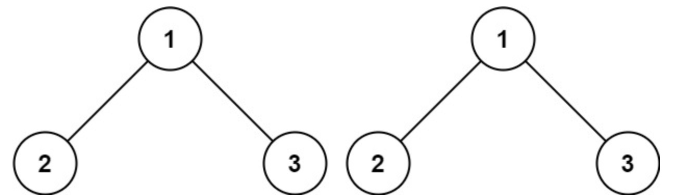
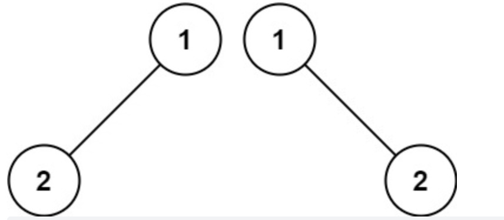
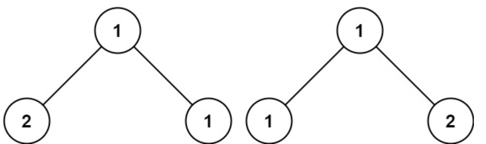

# 100.相同的树(简单)

题目描述：给你两棵二叉树的根节点 p 和 q，编写一个函数来检验这两棵树是否相同。

如果两个树在结构上相同，并且节点具有相同的值，则认为它们是相同的。

实例 1:



```js
输入：p = [1,2,3], q = [1,2,3]
输出：true
```

实例 2:



```js
输入：p = [1,2], q = [1,null,2]
输出：false
```

实例 3:



```js
输入：p = [1,2,1], q = [1,1,2]
输出：false
```
